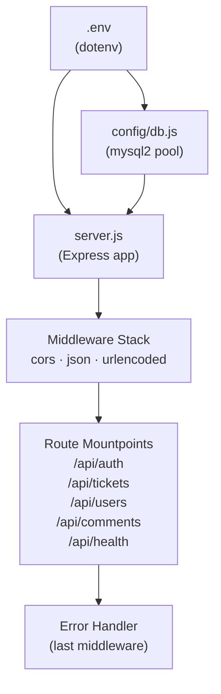
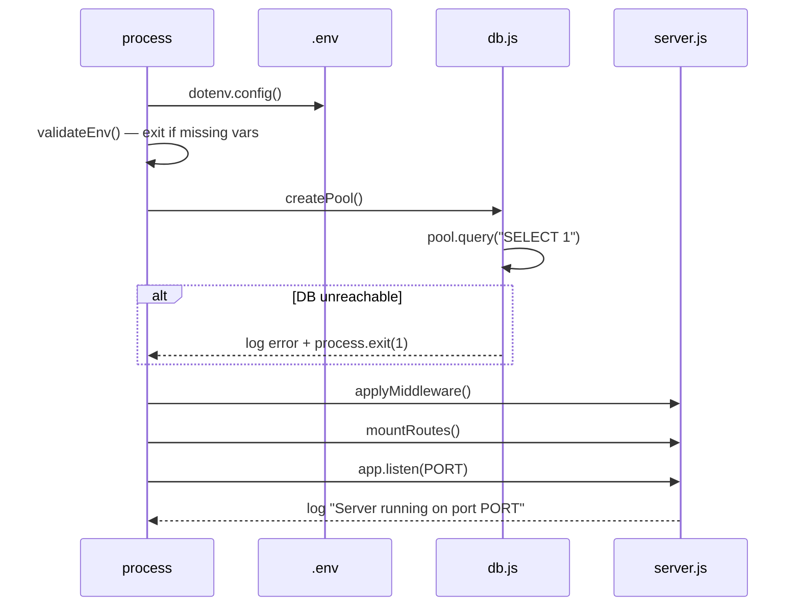

# Design Document: Backend Foundation

## Overview

The backend foundation establishes the three pillars that every other feature depends on:

1. **Environment configuration** — `dotenv`-based loading with startup validation
2. **Database connection** — a `mysql2/promise` connection pool with a verified startup ping
3. **Express server** — middleware stack, route mounting, 404 handling, and centralized error handling

The entry point is `backend/server.js`. It imports the pool from `backend/config/db.js`, registers middleware and routes, then starts listening. All configuration is read from `backend/.env`.

---

## Architecture



Startup sequence:



---

## Components and Interfaces

### `backend/.env`

Defines all runtime secrets and configuration. Never committed to source control.

```
PORT=3000
DB_HOST=localhost
DB_PORT=3306
DB_USER=root
DB_PASSWORD=secret
DB_NAME=ticketing_db
JWT_SECRET=changeme_supersecret
NODE_ENV=development
CORS_ORIGIN=http://localhost:5173
```

### `backend/config/db.js`

Responsible for creating and exporting the MySQL2 connection pool.

```js
// Pseudocode interface
createPool(config: PoolConfig): Pool
pool.query(sql: string): Promise<[rows, fields]>
pool.getConnection(): Promise<Connection>
```

Exported value: a single `pool` instance (default export or named `pool`).

### `backend/server.js`

The application entry point. Responsibilities:

- Load and validate environment variables
- Import and verify the DB pool
- Create the Express `app`
- Register middleware (cors, json, urlencoded)
- Mount routers
- Register 404 handler
- Register Error_Handler
- Call `app.listen(PORT)`

### Middleware Stack (order matters)

| Order | Middleware | Purpose |
|-------|-----------|---------|
| 1 | `cors(corsOptions)` | Allow cross-origin requests |
| 2 | `express.json()` | Parse JSON bodies |
| 3 | `express.urlencoded({ extended: true })` | Parse form bodies |
| 4 | Route handlers | Business logic |
| 5 | 404 handler | Catch unmatched routes |
| 6 | Error_Handler | Centralized error formatting |

### Route Mountpoints

| Path | Router file |
|------|------------|
| `GET /api/health` | Inline handler in server.js |
| `/api/auth` | `routes/authRoutes.js` |
| `/api/tickets` | `routes/ticketRoutes.js` |
| `/api/users` | `routes/userRoutes.js` |
| `/api/comments` | `routes/commentRoutes.js` |

Route files will be stubs at this stage — they export an Express Router with no handlers yet. This lets the server start cleanly while other features are built out.

### Error_Handler Signature

```js
// Express 4-argument error middleware
(err, req, res, next) => {
  const status = err.status || err.statusCode || 500;
  const body = { message: err.message || 'Internal Server Error' };
  if (process.env.NODE_ENV !== 'production') body.stack = err.stack;
  console.error(err);
  res.status(status).json(body);
}
```

---

## Data Models

No persistent data models are introduced in this feature. The DB pool is a connection utility, not a data model. Future models (`userModel.js`, `ticketModel.js`) will import the pool from `config/db.js`.

### Environment Variable Schema

| Variable | Type | Required | Default | Description |
|----------|------|----------|---------|-------------|
| `PORT` | number | no | 3000 | HTTP listen port |
| `DB_HOST` | string | yes | — | MySQL host |
| `DB_PORT` | number | no | 3306 | MySQL port |
| `DB_USER` | string | yes | — | MySQL username |
| `DB_PASSWORD` | string | yes | — | MySQL password |
| `DB_NAME` | string | yes | — | MySQL database name |
| `JWT_SECRET` | string | yes | — | JWT signing secret |
| `NODE_ENV` | string | no | development | Runtime environment |
| `CORS_ORIGIN` | string | no | * | Allowed CORS origin |

---

## Correctness Properties

*A property is a characteristic or behavior that should hold true across all valid executions of a system — essentially, a formal statement about what the system should do. Properties serve as the bridge between human-readable specifications and machine-verifiable correctness guarantees.*

Property 1: Missing required env var causes exit
*For any* subset of the required environment variables that is incomplete (one or more missing), calling `validateEnv()` should throw an error or call `process.exit` — it must never return normally.
**Validates: Requirements 1.3**

Property 2: Health endpoint always returns 200 with correct shape
*For any* running server instance, a `GET /api/health` request should return HTTP 200 and a JSON body where `status === "ok"`.
**Validates: Requirements 3.6**

Property 3: Unregistered routes return 404 with correct shape
*For any* path that is not a registered route, a request to that path should return HTTP 404 and a JSON body containing a `message` field.
**Validates: Requirements 4.5**

Property 4: Error handler status code propagation
*For any* error object passed to the Express error handler, the HTTP response status code should equal `err.status` or `err.statusCode` when present, and default to 500 otherwise.
**Validates: Requirements 5.2**

Property 5: Stack trace hidden in production
*For any* error passed to the Error_Handler while `NODE_ENV === "production"`, the response body should not contain a `stack` field.
**Validates: Requirements 5.3**

Property 6: Stack trace present in non-production
*For any* error passed to the Error_Handler while `NODE_ENV !== "production"`, the response body should contain a `stack` field.
**Validates: Requirements 5.3**

> Properties 5 and 6 together fully cover requirement 5.3 — they are complementary, not redundant, because they test opposite branches of the same condition.

---

## Error Handling

| Scenario | Behavior |
|----------|----------|
| Missing `.env` variable at startup | Log descriptive message, `process.exit(1)` |
| DB unreachable at startup | Log DB error, `process.exit(1)` |
| Unhandled route | 404 JSON `{ message: "Route not found" }` |
| Error passed to `next(err)` | Error_Handler returns structured JSON |
| Unhandled promise rejection | Log reason, `process.exit(1)` |
| `express.json()` parse error | Express emits 400 — caught by Error_Handler |

---

## Testing Strategy

### Unit Testing

Use **Jest** (or **Vitest**) for unit tests. Focus on:

- `validateEnv()` — test with complete and incomplete variable sets
- Error_Handler middleware — test status code selection, stack trace inclusion/exclusion
- 404 handler — verify response shape

### Property-Based Testing

Use **fast-check** for property tests. Each property test runs a minimum of 100 iterations.

Tag format: `Feature: backend-foundation, Property N: <property text>`

| Property | Test description | fast-check strategy |
|----------|-----------------|---------------------|
| P1 | Missing env var causes exit | Generate subsets of required vars with at least one removed |
| P2 | Health endpoint returns 200 + shape | Single example (deterministic endpoint) |
| P3 | Unknown routes return 404 + shape | Generate arbitrary path strings not in the route table |
| P4 | Error handler status propagation | Generate error objects with arbitrary `status`/`statusCode` values |
| P5 | No stack in production | Generate arbitrary errors, set `NODE_ENV=production` |
| P6 | Stack present in non-production | Generate arbitrary errors, set `NODE_ENV=development` |

### Dual Approach Rationale

Unit tests catch concrete bugs in specific scenarios (e.g., exact `.env` key names). Property tests verify the general correctness rules hold across all inputs — especially important for the error handler, which must behave correctly for any error shape thrown anywhere in the application.
