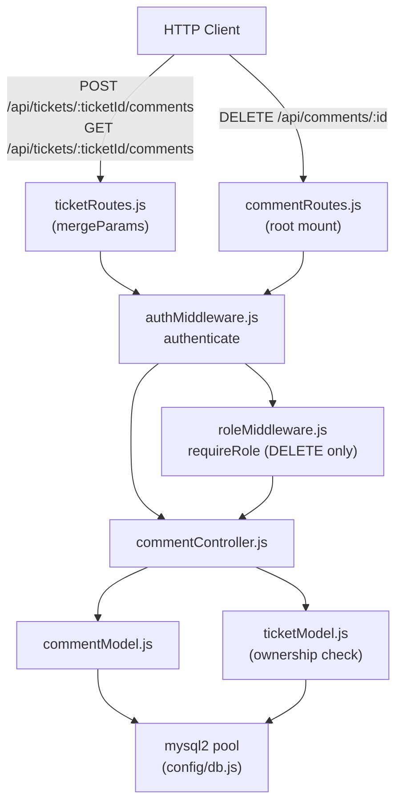
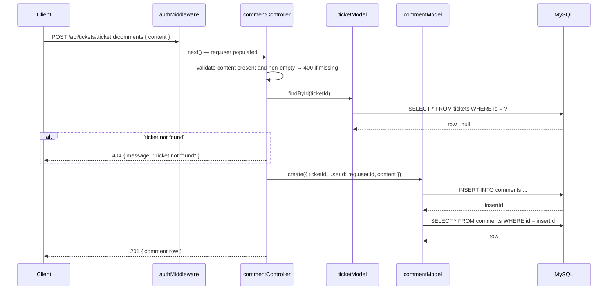
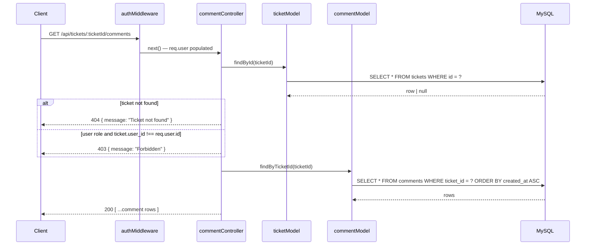
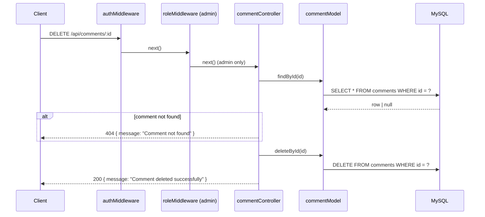

# Design Document: Comment Management

## Overview

The Comment Management feature adds threaded comments to IT helpdesk tickets. It introduces three new files:

- `backend/models/commentModel.js` — SQL data-access layer for the `comments` table
- `backend/controllers/commentController.js` — request handlers for add, list, and delete comment endpoints
- `backend/routes/commentRoutes.js` — Express router wiring comment endpoints with auth/role guards

Access control mirrors the ticket ownership model: regular users can only read or write comments on their own tickets; admins have unrestricted access. Route mounting uses Express `mergeParams` so the nested `/:ticketId/comments` routes inherit the `ticketId` param from the parent router.

---

## Architecture



### Request Flow — Add Comment



### Request Flow — Get Comments



### Request Flow — Delete Comment



---

## Components and Interfaces

### `backend/models/commentModel.js`

```js
// All functions return Promises and propagate DB errors to callers.

/**
 * @param {{ ticketId: number, userId: number, content: string }} data
 * @returns {Promise<Object>} the newly created comment row (full SELECT after INSERT)
 */
async function create({ ticketId, userId, content }) {}

/**
 * @param {number} ticketId
 * @returns {Promise<Object[]>} comment rows for the given ticket_id, ordered by created_at ASC
 */
async function findByTicketId(ticketId) {}

/**
 * @param {number} id
 * @returns {Promise<Object|null>} matching comment row or null
 */
async function findById(id) {}

/**
 * @param {number} id
 * @returns {Promise<number>} affectedRows
 */
async function deleteById(id) {}

module.exports = { create, findByTicketId, findById, deleteById };
```

### `backend/controllers/commentController.js`

```js
/**
 * POST /api/tickets/:ticketId/comments
 * Validates content, checks ticket exists, creates comment, returns 201.
 */
async function addComment(req, res, next) {}

/**
 * GET /api/tickets/:ticketId/comments
 * Checks ticket exists and ownership for non-admin, returns 200 with comment array.
 */
async function getComments(req, res, next) {}

/**
 * DELETE /api/comments/:id
 * Admin only. Checks comment exists, deletes it, returns 200.
 */
async function deleteComment(req, res, next) {}

module.exports = { addComment, getComments, deleteComment };
```

### `backend/routes/commentRoutes.js`

```js
const router = require('express').Router({ mergeParams: true });
const { authenticate } = require('../middleware/authMiddleware');
const { requireRole } = require('../middleware/roleMiddleware');
const { addComment, getComments, deleteComment } =
  require('../controllers/commentController');

// Nested under /api/tickets/:ticketId/comments (mounted in ticketRoutes.js)
router.post('/',  authenticate, addComment);
router.get('/',   authenticate, getComments);

// Standalone delete mounted separately under /api/comments in server.js
router.delete('/:id', authenticate, requireRole('admin'), deleteComment);

module.exports = router;
```

Note: `ticketRoutes.js` must be updated to nest the comment router:
```js
const commentRoutes = require('./commentRoutes');
// after existing ticket routes:
router.use('/:ticketId/comments', commentRoutes);
```

And `server.js` must mount the delete route:
```js
app.use('/api/comments', commentRoutes);
```

---

## Data Models

### `comments` Table DDL

```sql
CREATE TABLE IF NOT EXISTS comments (
  id         INT UNSIGNED NOT NULL AUTO_INCREMENT,
  ticket_id  INT UNSIGNED NOT NULL,
  user_id    INT UNSIGNED NOT NULL,
  content    TEXT         NOT NULL,
  created_at DATETIME     NOT NULL DEFAULT CURRENT_TIMESTAMP,
  PRIMARY KEY (id),
  CONSTRAINT fk_comments_ticket FOREIGN KEY (ticket_id) REFERENCES tickets(id),
  CONSTRAINT fk_comments_user   FOREIGN KEY (user_id)   REFERENCES users(id)
);
```

### Comment Row Shape

```json
{
  "id": 1,
  "ticket_id": 42,
  "user_id": 7,
  "content": "This issue has been escalated.",
  "created_at": "2024-01-15T10:30:00.000Z"
}
```

### API Response Shapes

Add / success:
```json
{ "id": 1, "ticket_id": 42, "user_id": 7, "content": "...", "created_at": "..." }
```

List success:
```json
[ { "id": 1, ... }, { "id": 2, ... } ]
```

Delete success:
```json
{ "message": "Comment deleted successfully" }
```

Error responses:
```json
{ "message": "<human-readable description>" }
```

---

## Correctness Properties

*A property is a characteristic or behavior that should hold true across all valid executions of a system — essentially, a formal statement about what the system should do. Properties serve as the bridge between human-readable specifications and machine-verifiable correctness guarantees.*

Property 1: Create round-trip
*For any* valid `{ ticketId, userId, content }` input, calling `create()` and then `findById()` with the returned id must produce a row where `ticket_id`, `user_id`, and `content` exactly match the input.
**Validates: Requirements 2.1**

Property 2: findByTicketId filter and ordering
*For any* set of comments across multiple tickets, `findByTicketId(ticketId)` must return only rows where `ticket_id` equals the given value, ordered by `created_at` ascending (each row's `created_at` is less than or equal to the next row's).
**Validates: Requirements 2.2**

Property 3: deleteById round-trip
*For any* existing comment, `deleteById(id)` must return `affectedRows` of 1, and a subsequent `findById(id)` must return `null`.
**Validates: Requirements 2.4**

Property 4: Add comment sets correct foreign keys
*For any* authenticated user making a valid `POST /api/tickets/:ticketId/comments` request, the created comment's `ticket_id` must equal the `:ticketId` route parameter and `user_id` must equal `req.user.id` — neither can be overridden via the request body.
**Validates: Requirements 3.1, 3.2**

Property 5: Add comment rejects empty content
*For any* string composed entirely of whitespace (including the empty string), a `POST /api/tickets/:ticketId/comments` request with that content must return HTTP 400 with `{ "message": "Content is required" }` and no comment must be inserted.
**Validates: Requirements 3.3**

Property 6: Get comments ownership enforcement
*For any* regular user and any ticket whose `user_id` does not equal that user's id, a `GET /api/tickets/:ticketId/comments` request must return HTTP 403 with `{ "message": "Forbidden" }`.
**Validates: Requirements 4.3**

Property 7: Delete comment round-trip
*For any* existing comment, an admin `DELETE /api/comments/:id` request must return HTTP 200 with `{ "message": "Comment deleted successfully" }`, and a subsequent `GET /api/tickets/:ticketId/comments` must not include that comment.
**Validates: Requirements 5.1, 5.2**

---

## Error Handling

| Scenario | Handler | HTTP Status | Response body |
|----------|---------|-------------|---------------|
| Missing or empty content on add | commentController.addComment | 400 | `{ message: "Content is required" }` |
| Ticket not found on add or get | commentController.addComment / getComments | 404 | `{ message: "Ticket not found" }` |
| User accessing comments on another user's ticket | commentController.getComments | 403 | `{ message: "Forbidden" }` |
| Comment not found on delete | commentController.deleteComment | 404 | `{ message: "Comment not found" }` |
| Non-admin attempting DELETE | roleMiddleware (requireRole) | 403 | `{ message: "Forbidden" }` |
| Missing / malformed Authorization header | authMiddleware | 401 | `{ message: "No token provided" }` |
| Invalid or expired JWT | authMiddleware | 401 | `{ message: "Invalid or expired token" }` |
| Unexpected DB error | next(err) → Error_Handler | 500 | `{ message: "Internal Server Error" }` |

All unexpected errors are forwarded to the existing centralized error handler via `next(err)`.

---

## Testing Strategy

### Unit Testing

Use **Jest** with **supertest** for HTTP-level tests and plain unit tests for model functions. Focus on:

- `commentModel` — mock the DB pool and verify correct SQL for each method; test `null` return for missing rows
- `commentController` — test each validation branch (empty content, ticket not found, ownership check) and happy paths for all three handlers
- Route-level integration — verify auth middleware is applied and DELETE is admin-only

### Property-Based Testing

Use **fast-check** (already in `devDependencies`). Each property test runs a minimum of 100 iterations.

Tag format: `Feature: comment-management, Property N: <property text>`

| Property | Test description | fast-check strategy |
|----------|-----------------|---------------------|
| P1 | Create round-trip | `fc.record({ ticketId: fc.integer({min:1}), userId: fc.integer({min:1}), content: fc.string({minLength:1}) })` → create → findById → assert fields match |
| P2 | findByTicketId filter and ordering | Insert comments for multiple ticketIds → findByTicketId(id) → assert all rows have correct ticket_id and created_at is non-decreasing |
| P3 | deleteById round-trip | Create comment → deleteById → findById → assert null |
| P4 | Add comment sets correct foreign keys | Generate user ids and ticketIds → POST → assert comment.ticket_id and comment.user_id match |
| P5 | Add comment rejects empty content | `fc.stringMatching(/^\s*$/)` → POST → assert 400 |
| P6 | Get comments ownership enforcement | Generate user + ticket owned by different user → GET → assert 403 |
| P7 | Delete comment round-trip | Create comment → admin DELETE → GET comments → assert not present |

### Dual Approach Rationale

Unit tests pin down exact error messages, HTTP status codes, and SQL query shapes. Property tests verify that ownership rules and filtering logic hold across all possible inputs — critical for access-control correctness where a single edge case can be a security vulnerability.
