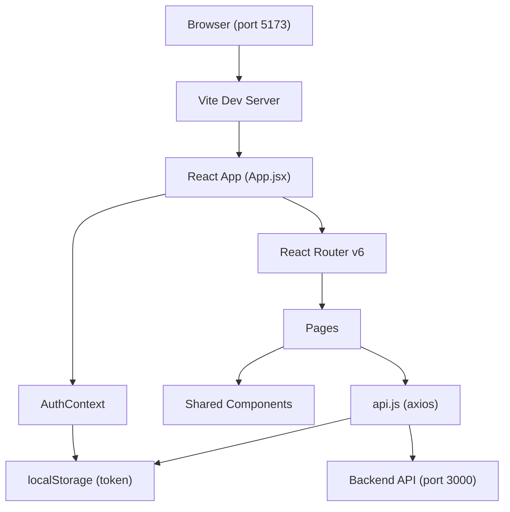
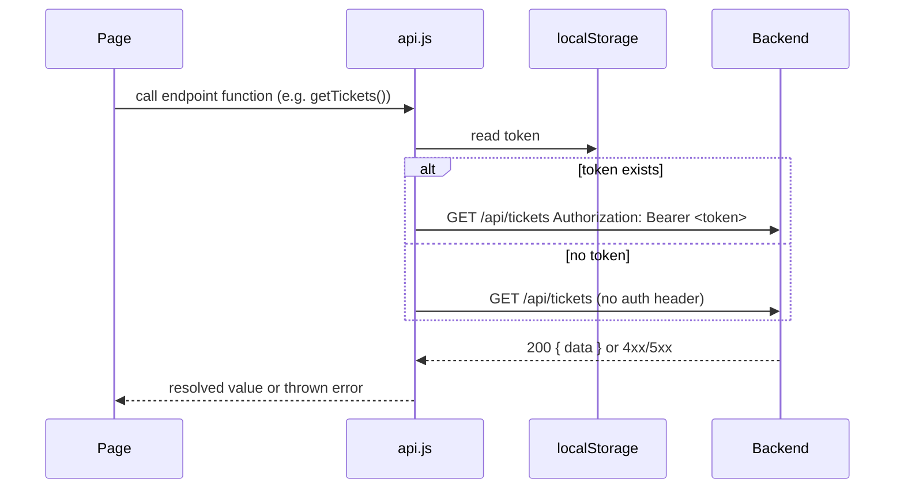
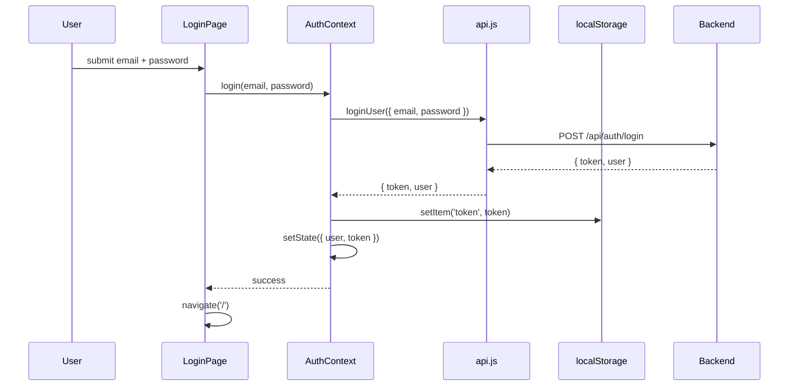

# Design Document: Frontend Application

## Overview

The frontend is a React 18 + Vite single-page application (SPA) served at `http://localhost:5173`. It communicates exclusively with the backend REST API at `http://localhost:3000` via a centralized axios service layer. Authentication state is managed through a React context that reads and writes a JWT to `localStorage`. React Router v6 handles client-side routing with protected route wrappers. Styling uses minimal inline styles with no external CSS framework.

The file layout matches what already exists in the repository:

```
frontend/
├── index.html
├── package.json
├── vite.config.js
├── main.jsx                      # ReactDOM.createRoot entry point
├── App.jsx                       # Router + route tree
├── context/
│   └── AuthContext.jsx           # Auth state, login/logout/register
├── services/
│   └── api.js                    # Axios instance + endpoint wrappers
├── pages/
│   ├── Login.jsx
│   ├── Register.jsx
│   ├── Dashboard.jsx
│   ├── CreateTicket.jsx
│   ├── TicketDetail.jsx
│   └── AdminPanel.jsx
└── src/
    └── components/
        ├── Navbar.jsx
        ├── StatusBadge.jsx
        └── TicketCard.jsx
```

---

## Architecture



### Request lifecycle



### Authentication flow



---

## Components and Interfaces

### `frontend/services/api.js`

Creates a single axios instance. A request interceptor reads `localStorage` before every call and injects the `Authorization` header if a token is present.

```js
import axios from 'axios';

const api = axios.create({ baseURL: 'http://localhost:3000' });

// Request interceptor — inject token
api.interceptors.request.use(config => {
  const token = localStorage.getItem('token');
  if (token) config.headers.Authorization = `Bearer ${token}`;
  return config;
});

// Auth
export const loginUser    = (data) => api.post('/api/auth/login', data);
export const registerUser = (data) => api.post('/api/auth/register', data);

// Tickets
export const getTickets    = ()         => api.get('/api/tickets');
export const getTicketById = (id)       => api.get(`/api/tickets/${id}`);
export const createTicket  = (data)     => api.post('/api/tickets', data);
export const updateTicket  = (id, data) => api.put(`/api/tickets/${id}`, data);
export const deleteTicket  = (id)       => api.delete(`/api/tickets/${id}`);

// Comments
export const getComments   = (ticketId)            => api.get(`/api/tickets/${ticketId}/comments`);
export const postComment   = (ticketId, data)      => api.post(`/api/tickets/${ticketId}/comments`, data);
export const deleteComment = (commentId)           => api.delete(`/api/comments/${commentId}`);

// Users (admin)
export const getUsers      = ()         => api.get('/api/users');
export const getUserById   = (id)       => api.get(`/api/users/${id}`);
export const updateUserRole = (id, role) => api.put(`/api/users/${id}/role`, { role });
export const deleteUser    = (id)       => api.delete(`/api/users/${id}`);
```

### `frontend/context/AuthContext.jsx`

Holds `user` and `token` state. On mount it checks `localStorage` for an existing token, decodes the payload (base64 split — no library needed), and hydrates the state. Exposes `login`, `register`, and `logout`.

```jsx
const AuthContext = React.createContext(null);

export function AuthProvider({ children }) {
  const [user, setUser]   = useState(null);
  const [token, setToken] = useState(null);

  // Hydrate from localStorage on first render
  useEffect(() => {
    const stored = localStorage.getItem('token');
    if (stored) {
      const payload = JSON.parse(atob(stored.split('.')[1]));
      setUser(payload);
      setToken(stored);
    }
  }, []);

  const login    = async (email, password) => { /* call loginUser, persist, setState */ };
  const register = async (name, email, password) => { /* call registerUser, persist, setState */ };
  const logout   = () => { localStorage.removeItem('token'); setUser(null); setToken(null); };

  return <AuthContext.Provider value={{ user, token, login, register, logout }}>{children}</AuthContext.Provider>;
}

export const useAuth = () => React.useContext(AuthContext);
```

### `frontend/App.jsx`

Wraps everything in `BrowserRouter` and `AuthProvider`. Defines the route tree with `ProtectedRoute` and `AdminRoute` wrappers.

```jsx
function ProtectedRoute({ children }) {
  const { user } = useAuth();
  return user ? children : <Navigate to="/login" />;
}

function AdminRoute({ children }) {
  const { user } = useAuth();
  if (!user) return <Navigate to="/login" />;
  if (user.role !== 'admin') return <Navigate to="/" />;
  return children;
}

// Route tree:
// /login           → <Login>
// /register        → <Register>
// /                → <ProtectedRoute><Dashboard></ProtectedRoute>
// /tickets/new     → <ProtectedRoute><CreateTicket></ProtectedRoute>
// /tickets/:id     → <ProtectedRoute><TicketDetail></ProtectedRoute>
// /admin           → <AdminRoute><AdminPanel></AdminRoute>
```

### `frontend/src/components/Navbar.jsx`

Reads `user` from `useAuth()`. Conditionally renders the Admin Panel link. Calls `logout()` and then navigates to `/login` on button click.

```jsx
// Props: none (reads from context)
// Renders: App title link, Dashboard link, Admin link (admin only), user name, logout button
```

### `frontend/src/components/StatusBadge.jsx`

Pure presentational component. Maps status strings to inline background/text color styles.

```jsx
// Props: { status: 'open' | 'in_progress' | 'resolved' | 'closed' }
const COLOR_MAP = {
  open:        { background: '#dbeafe', color: '#1d4ed8' },
  in_progress: { background: '#ffedd5', color: '#c2410c' },
  resolved:    { background: '#dcfce7', color: '#15803d' },
  closed:      { background: '#f3f4f6', color: '#6b7280' },
};
```

### `frontend/src/components/TicketCard.jsx`

Renders a clickable summary card. Uses `useNavigate` to push `/tickets/:id` on click.

```jsx
// Props: { ticket: { id, title, priority, status, created_at } }
// Renders: title, priority label, StatusBadge, formatted created_at date
// onClick: navigate(`/tickets/${ticket.id}`)
```

---

## Data Models

### Auth Token Payload (decoded JWT)

```json
{
  "id": 1,
  "email": "user@example.com",
  "role": "user",
  "iat": 1700000000,
  "exp": 1700086400
}
```

The `user` object stored in `AuthContext` is this decoded payload.

### Ticket shape (from API)

```json
{
  "id": 1,
  "title": "Printer not working",
  "description": "The printer on floor 2 is offline.",
  "status": "open",
  "priority": "medium",
  "user_id": 42,
  "assigned_to": null,
  "created_at": "2024-01-15T09:00:00.000Z",
  "updated_at": "2024-01-15T09:00:00.000Z"
}
```

### Comment shape (from API)

```json
{
  "id": 5,
  "ticket_id": 1,
  "user_id": 42,
  "content": "We are looking into this.",
  "created_at": "2024-01-15T10:00:00.000Z"
}
```

### User shape (from API)

```json
{
  "id": 42,
  "name": "Alice",
  "email": "alice@example.com",
  "role": "user",
  "created_at": "2024-01-01T00:00:00.000Z"
}
```

### Valid enum values

| Field | Valid values |
|-------|-------------|
| `status` | `'open'`, `'in_progress'`, `'resolved'`, `'closed'` |
| `priority` | `'low'`, `'medium'`, `'high'` |
| `role` | `'user'`, `'admin'` |

---


## Correctness Properties

*A property is a characteristic or behavior that should hold true across all valid executions of a system — essentially, a formal statement about what the system should do. Properties serve as the bridge between human-readable specifications and machine-verifiable correctness guarantees.*

Property 1: Token injection invariant
*For any* non-empty token string stored in `localStorage`, every HTTP request made through the API_Service must include an `Authorization: Bearer <token>` header whose value exactly matches the stored token.
**Validates: Requirements 2.2**

Property 2: Error propagation
*For any* API endpoint function in `api.js`, when the backend responds with a 4xx or 5xx status code, the function must throw (reject) rather than resolve, so the calling component receives the error.
**Validates: Requirements 2.5**

Property 3: Auth round-trip (login and register)
*For any* valid login or register response containing a `{ token, user }` payload, after calling `login()` or `register()`, `localStorage.getItem('token')` must equal the received token and the Auth_Context `user` state must equal the decoded token payload.
**Validates: Requirements 3.3, 3.4**

Property 4: Logout clears state
*For any* authenticated session, calling `logout()` must result in `localStorage.getItem('token')` returning `null` and the Auth_Context `user` state being `null`.
**Validates: Requirements 3.5**

Property 5: Token hydration on init
*For any* valid JWT string pre-seeded in `localStorage` before the AuthProvider mounts, the `user` state after mount must equal the object produced by decoding the JWT's base64 payload — with no network request made.
**Validates: Requirements 3.6**

Property 6: Protected routes redirect unauthenticated users
*For any* route path that is wrapped in `ProtectedRoute`, when the Auth_Context `user` is `null`, navigating to that path must result in the router rendering the `/login` page instead.
**Validates: Requirements 4.7**

Property 7: Authenticated users redirected from public auth routes
*For any* route path in `['/login', '/register']`, when the Auth_Context `user` is not `null`, navigating to that path must result in the router rendering the `/` page instead.
**Validates: Requirements 4.9**

Property 8: API error messages are surfaced to the user
*For any* component that makes API calls (Login, Register, Dashboard, CreateTicket, TicketDetail, AdminPanel), when the API rejects with an error containing a `response.data.message` string, that string must appear in the rendered output.
**Validates: Requirements 5.3, 6.3, 10.4, 11.3, 12.3, 13.6**

Property 9: StatusBadge renders correct color for every valid status
*For any* status value in `['open', 'in_progress', 'resolved', 'closed']`, the StatusBadge must apply the correct color style: blue for `open`, orange for `in_progress`, green for `resolved`, grey for `closed`.
**Validates: Requirements 8.2, 8.3, 8.4, 8.5**

Property 10: TicketCard renders all required ticket fields
*For any* ticket object with `title`, `priority`, `status`, and `created_at`, the TicketCard must render all four fields in its output, and the `created_at` value must be rendered in a human-readable format (not a raw ISO string).
**Validates: Requirements 9.1, 9.3**

Property 11: TicketCard click navigates to correct route
*For any* ticket with id `n`, clicking the TicketCard must trigger navigation to `/tickets/n`.
**Validates: Requirements 9.4**

Property 12: AdminPanel displays required fields for every user
*For any* list of users returned by the API, the AdminPanel must render each user's `name`, `email`, and `role` in its output.
**Validates: Requirements 13.3**

Property 13: AdminPanel displays required fields for every ticket
*For any* list of tickets returned by the API, the AdminPanel must render each ticket's `title`, `status`, and owner info, and each ticket must include a link to `/tickets/:id`.
**Validates: Requirements 13.7, 13.8**

Property 14: Admin sees delete button for every comment in TicketDetail
*For any* list of comments on a ticket, when the Requesting_User has the `admin` role, every comment in the rendered list must include a delete button.
**Validates: Requirements 12.9**

---

## Error Handling

| Scenario | Component | Behavior |
|----------|-----------|----------|
| Empty email or password on login | Login | Show inline validation error; do not call API |
| Empty name, email, or password on register | Register | Show inline validation error; do not call API |
| Empty title or description on create ticket | CreateTicket | Show inline validation error; do not call API |
| Backend returns error on login | Login | Display `error.response.data.message` |
| Backend returns error on register | Register | Display `error.response.data.message` |
| Backend returns error on ticket create | CreateTicket | Display `error.response.data.message` |
| Backend returns error on ticket/comment fetch | Dashboard, TicketDetail | Display error message in place of content |
| Backend returns error on comment post | TicketDetail | Display error message below comment form |
| Backend returns error on status update | TicketDetail | Display error message near status selector |
| Backend returns error on user role update or delete | AdminPanel | Display error message near the affected row |
| No token in localStorage (unauthenticated) | All API calls | No `Authorization` header sent; 401 response will propagate as error |
| Expired / invalid token | All API calls | Backend returns 401; error propagates to component for display |
| Loading state | Dashboard, TicketDetail, AdminPanel | Show "Loading…" text while API call is in flight |

---

## Testing Strategy

### Unit Testing

Use **Vitest** with **@testing-library/react** for component tests. Focus on:

- `api.js` — test that the axios interceptor injects the token header when present, and omits it when absent; verify each exported function calls the correct HTTP method and URL
- `AuthContext` — test initial hydration from localStorage, login/register state updates, logout cleanup
- `ProtectedRoute` / `AdminRoute` — test redirect behavior for unauthenticated users and non-admin users
- `StatusBadge` — test color mapping for all four statuses
- `TicketCard` — test rendering of required fields and click navigation
- Pages — test loading state, empty state, error display, and form validation for each page

### Property-Based Testing

Use **fast-check** for universal-property tests. Each property test runs a minimum of 100 iterations.

Tag format: `Feature: frontend-app, Property N: <property text>`

| Property | Component | fast-check strategy |
|----------|-----------|---------------------|
| P1: Token injection | api.js interceptor | `fc.string({ minLength: 1 })` as token → mock axios adapter → assert header present |
| P2: Error propagation | api.js | `fc.constantFrom(400, 401, 403, 404, 500)` → mock backend with that status → assert promise rejects |
| P3: Auth round-trip | AuthContext | `fc.record({ token: validJwtArb, user: userArb })` → call login/register → assert localStorage and state |
| P4: Logout clears state | AuthContext | Any authenticated state → call logout → assert localStorage null and user null |
| P5: Token hydration | AuthContext | `validJwtArb` pre-seeded in localStorage → mount AuthProvider → assert user equals decoded payload |
| P6: Protected route redirect | ProtectedRoute | `fc.constantFrom('/','tickets/new','/tickets/1','/admin')` with no user → assert renders /login |
| P7: Redirect from public routes | Router | `fc.constantFrom('/login','/register')` with logged-in user → assert renders / |
| P8: Error messages surfaced | All pages | `fc.string({ minLength: 1 })` as error message → mock API rejection → assert message in DOM |
| P9: StatusBadge color map | StatusBadge | `fc.constantFrom('open','in_progress','resolved','closed')` → render → assert correct style |
| P10: TicketCard fields | TicketCard | `fc.record({ title, priority, status, created_at })` → render → assert all fields present |
| P11: TicketCard navigation | TicketCard | `fc.integer({ min: 1 })` as ticket id → click → assert navigate called with `/tickets/${id}` |
| P12: AdminPanel user fields | AdminPanel | `fc.array(userArb, { minLength: 1 })` → render → assert name, email, role visible for each |
| P13: AdminPanel ticket fields | AdminPanel | `fc.array(ticketArb, { minLength: 1 })` → render → assert title, status, link visible for each |
| P14: Admin comment delete buttons | TicketDetail | `fc.array(commentArb, { minLength: 1 })` with admin user → render → assert delete button per comment |

### Dual Approach Rationale

Unit tests pin down specific interactions — form submissions, routing decisions, loading/error states for concrete inputs. Property tests verify that the token interceptor, error propagation, and rendering invariants hold across arbitrary inputs, catching edge cases like unusual token strings, unexpected error message formats, or ticket/user lists of any length.
