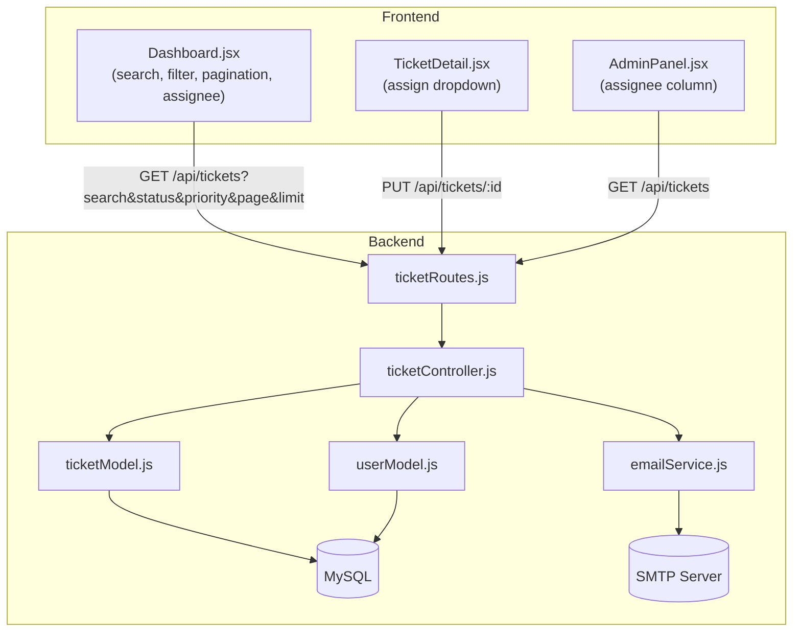

# Design Document: Ticket Enhancements

## Overview

This document describes the technical design for four enhancements to the IT Helpdesk Ticketing System:

1. **Email Notification** — notify ticket owners via email when their ticket status changes
2. **Search & Filter** — filter ticket listings by keyword, status, and priority
3. **Pagination** — return paginated results from `GET /api/tickets`
4. **Assign Ticket** — allow admins to assign tickets to users with assignee name shown in UI

All backend code is Node.js (CommonJS) with Express and MySQL via `mysql2/promise`. The frontend uses React with a functional component pattern. The property-based testing library is **fast-check**, which is already present in `devDependencies`.

---

## Architecture



---

## Components and Interfaces

### Backend: emailService.js (new)

File: `backend/services/emailService.js`

A nodemailer transporter is created once at module load from environment variables. The module exports a single function:

```js
/**
 * Sends a status-change notification email to the ticket owner.
 * @param {string} userEmail  - recipient address
 * @param {string} ticketTitle - title of the affected ticket
 * @param {string} newStatus  - new status value
 * @returns {Promise<void>}
 */
async function sendStatusChangeEmail(userEmail, ticketTitle, newStatus)
```

The email subject is `"Ticket status updated: <ticketTitle>"` and the plain-text body includes both `ticketTitle` and `newStatus`. Configuration is read from `SMTP_HOST`, `SMTP_PORT`, `SMTP_USER`, `SMTP_PASS`, `SMTP_FROM`.

### Backend: ticketModel.js (updated signatures)

```js
// filters: { search?, status?, priority? }
// pagination: { page?, limit? }
// returns { rows: Ticket[], total: number }
async function findAll(filters = {}, pagination = {})

async function findByUserId(userId, filters = {}, pagination = {})
```

Both functions:
- Build a parameterised dynamic WHERE clause from the filter object
- Execute a `LEFT JOIN users u ON tickets.assigned_to = u.id` to include `u.name AS assigned_to_name`
- Run a `COUNT(*)` sub-query (same WHERE, no LIMIT) to get `total`
- Apply `LIMIT limit OFFSET (page-1)*limit` for the data query
- Return `{ rows, total }`

`findById` is also updated to include the same LEFT JOIN so `assigned_to_name` is present on single-ticket fetches.

### Backend: ticketController.js (updated handlers)

**getTickets** changes:
- Extract `search`, `status`, `priority` from `req.query`; validate `status`/`priority` against allowed enums → 400 on mismatch
- Extract `page`, `limit` from `req.query`; parse as integers; default to `page=1`, `limit=10`; return 400 if either is non-positive or non-numeric
- Pass filter + pagination objects to `ticketModel.findAll` / `findByUserId`
- Compute `totalPages = Math.ceil(total / limit)`
- Respond: `{ data: rows, total, page, limit, totalPages }`

**updateTicket** changes (status-change email):
- Capture `prevStatus = ticket.status` before update
- After successful `ticketModel.update`, if the `status` field was changed (`fields.status !== undefined && fields.status !== prevStatus`), fetch owner via `userModel.findById(ticket.user_id)` and call `emailService.sendStatusChangeEmail`
- Wrap the email call in `try/catch`; log errors but do not alter the HTTP response

### Frontend: Dashboard.jsx (updated)

New state: `search` (string), `status` (string, default `''`), `priority` (string, default `''`), `page` (number, default 1), `limit` (number, default 10), `total` (number), `totalPages` (number).

`useEffect` depends on `[search, status, priority, page]`. When any change, calls:
```
GET /api/tickets?search=…&status=…&priority=…&page=…&limit=10
```
and sets `tickets = res.data.data`, `total = res.data.total`, `totalPages = res.data.totalPages`.

New UI elements rendered above the ticket list:
- Text input bound to `search` (debounced or on-change resets page to 1)
- `<select>` for status with options: `all | open | in_progress | resolved | closed`
- `<select>` for priority with options: `all | low | medium | high`
- Pagination row: `<button disabled={page===1}>Previous</button>` / `Page N of M` / `<button disabled={page===totalPages}>Next</button>`

Each `TicketCard` receives the `assigned_to_name` field and renders it when present.

### Frontend: TicketDetail.jsx (updated)

When `user.role === 'admin'`, adds a second admin-control section below status:
- Fetches `GET /api/users` on mount (alongside ticket + comments)
- Renders `<select>` populated with users; current value is `ticket.assigned_to ?? ''`
- On change calls `updateTicket(id, { assigned_to: selectedUserId })` then calls `load()` to refresh
- Displays the current `ticket.assigned_to_name` or "Unassigned"

### Frontend: AdminPanel.jsx (updated)

The tickets table adds an "Assignee" `<th>` and renders `ticket.assigned_to_name ?? '—'` in the corresponding `<td>`.

---

## Data Models

### Ticket row (with assignee join)

```ts
{
  id: number,
  title: string,
  description: string,
  status: 'open' | 'in_progress' | 'resolved' | 'closed',
  priority: 'low' | 'medium' | 'high',
  user_id: number,
  assigned_to: number | null,
  assigned_to_name: string | null,   // from LEFT JOIN users
  created_at: string,
  updated_at: string
}
```

### Paginated API response shape

```ts
{
  data: Ticket[],
  total: number,       // total matching records (after filters)
  page: number,        // current page (1-indexed)
  limit: number,       // page size
  totalPages: number   // Math.ceil(total / limit)
}
```

### Environment variables added to .env

| Variable  | Description                         |
|-----------|-------------------------------------|
| SMTP_HOST | SMTP server hostname                |
| SMTP_PORT | SMTP server port (e.g. 587)         |
| SMTP_USER | SMTP authentication username        |
| SMTP_PASS | SMTP authentication password        |
| SMTP_FROM | Sender address (e.g. noreply@…)    |

---

## Correctness Properties

*A property is a characteristic or behavior that should hold true across all valid executions of a system — essentially, a formal statement about what the system should do. Properties serve as the bridge between human-readable specifications and machine-verifiable correctness guarantees.*

### Property 1: Email arguments correctness

*For any* valid ticket whose status is changed by an admin, `sendStatusChangeEmail` must be called exactly once with the owner's email address, and the resulting mail object's `subject` and `text` fields must each contain the ticket's title and new status as substrings.

**Validates: Requirements 1.2, 1.7**

---

### Property 2: Email failure does not affect HTTP response

*For any* ticket status update where `sendStatusChangeEmail` throws an error, the HTTP response status must still be 200 and the body must contain the updated ticket data.

**Validates: Requirements 1.5**

---

### Property 3: Filter predicates are fully satisfied

*For any* ticket dataset and any combination of active filters `{ search, status, priority }`, every ticket in the returned `data` array must satisfy all active filter predicates simultaneously: title contains `search` (case-insensitive), status equals the filter status, priority equals the filter priority.

**Validates: Requirements 2.1, 2.2, 2.3, 2.4**

---

### Property 4: Invalid filter enum values return HTTP 400

*For any* string value for `status` or `priority` that is not in the allowed enum sets (`['open','in_progress','resolved','closed']` and `['low','medium','high']` respectively), the response status code must be 400.

**Validates: Requirements 2.7**

---

### Property 5: Pagination response shape and slice invariant

*For any* valid `page` and `limit` values and any ticket dataset, the response must:
- Have the shape `{ data, total, page, limit, totalPages }`
- Satisfy `data.length <= limit`
- Satisfy `totalPages === Math.ceil(total / limit)`
- Have `page` in the response equal to the requested page

**Validates: Requirements 3.1, 3.2, 3.4, 3.6**

---

### Property 6: Full dataset coverage across pages

*For any* ticket dataset, fetching all pages sequentially (page 1 through totalPages) with a fixed limit and concatenating the `data` arrays must produce a collection whose ticket IDs exactly match the full set of ticket IDs in the dataset — no duplicates, no omissions.

**Validates: Requirements 3.1, 3.2, 3.5, 3.6**

---

### Property 7: Invalid pagination parameters return HTTP 400

*For any* request where `page` or `limit` is a non-positive number or a non-numeric string, the response status code must be 400.

**Validates: Requirements 3.7**

---

### Property 8: Assign ticket round-trip

*For any* ticket and any valid user id, when an admin PUTs `{ assigned_to: userId }` and then GETs the ticket by id, the response must have `assigned_to === userId` and `assigned_to_name` equal to the name of the user with that id.

**Validates: Requirements 4.1, 4.3, 4.4**

---

### Property 9: Non-admin cannot modify assignee

*For any* ticket with an existing `assigned_to` value and any non-admin user, a PUT request that includes an `assigned_to` field must leave `assigned_to` unchanged in the database.

**Validates: Requirements 4.2**

---

### Property 10: Assignee name rendered in ticket lists

*For any* ticket that has `assigned_to_name` set, the rendered output of the ticket list component (Dashboard or AdminPanel) must contain that name as a visible string.

**Validates: Requirements 4.8, 4.9**

---

## Error Handling

| Scenario | Behaviour |
|---|---|
| SMTP send fails at runtime | Controller catches, logs, returns HTTP 200 with updated ticket |
| Invalid `status`/`priority` filter query param | Controller returns HTTP 400 with descriptive message |
| `page` or `limit` is non-integer or ≤ 0 | Controller returns HTTP 400 with descriptive message |
| `assigned_to` user id not found in users table | Controller calls `userModel.findById`, gets null, returns HTTP 400 |
| Ticket not found on PUT | Controller returns HTTP 404 (existing behaviour) |
| Non-admin attempts to set `assigned_to` | Field silently stripped before model update |

---

## Testing Strategy

### Dual Testing Approach

Unit tests and property-based tests are complementary and both required. Unit tests cover specific examples, integration points, and edge cases. Property-based tests verify universal correctness across many generated inputs.

### Property-Based Testing

Library: **fast-check** (already in `devDependencies`).

Each property test runs a minimum of **100 iterations**. Each test is annotated with:

> `// Feature: ticket-enhancements, Property N: <property_title>`

| Property | fast-check approach |
|---|---|
| Property 1 | Arbitraries for email string, ticket title, status enum; mock nodemailer; assert `sendMail` args |
| Property 2 | Arbitrary ticket; force `sendMail` to reject; assert response status 200 and body has ticket |
| Property 3 | Arbitrary ticket array + filter combos; assert every returned item satisfies all active predicates |
| Property 4 | `fc.string()` filtered to exclude valid enums; assert HTTP 400 |
| Property 5 | Arbitrary page + limit integers; assert shape, `data.length <= limit`, totalPages formula |
| Property 6 | Arbitrary dataset size + limit; fetch all pages; assert ID set equality |
| Property 7 | `fc.oneof(fc.float({ max: 0 }), fc.string())` for page/limit; assert HTTP 400 |
| Property 8 | Arbitrary userId that exists; PUT then GET; assert assigned_to and assigned_to_name |
| Property 9 | Arbitrary non-admin + arbitrary assigned_to value; PUT; assert DB value unchanged |
| Property 10 | Arbitrary ticket with assigned_to_name; render component; assert name appears in output |

### Unit Tests

- `emailService`: mock transporter; verify `sendMail` called with correct `to`, `subject`, and body containing title + status.
- `ticketController.updateTicket`: verify email called on status change; NOT called when status unchanged; email errors don't change response code.
- `ticketController.getTickets`: verify default pagination values (`page=1`, `limit=10`); verify paginated response shape; verify 400 on invalid params.
- `ticketModel.findAll` / `findByUserId`: verify LEFT JOIN present in query; verify LIMIT/OFFSET arithmetic for various page/limit combos.
- Dashboard: render with mock API response; assert filter inputs and pagination buttons present; assert Previous disabled on page 1; assert Next disabled on last page.
- TicketDetail (admin): assert assignee dropdown rendered for admin role; not rendered for user role.
