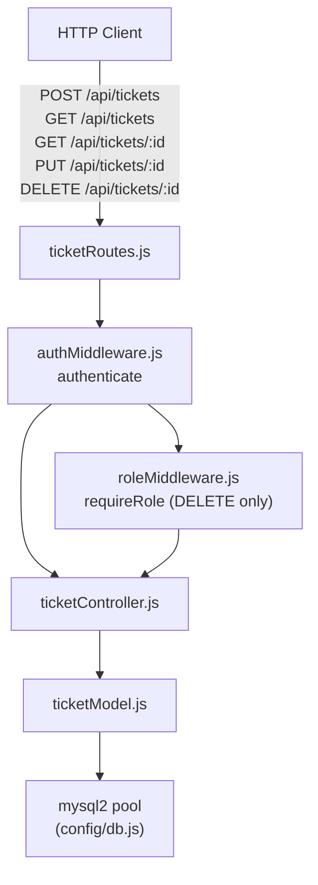
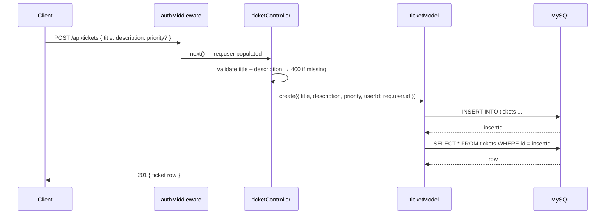
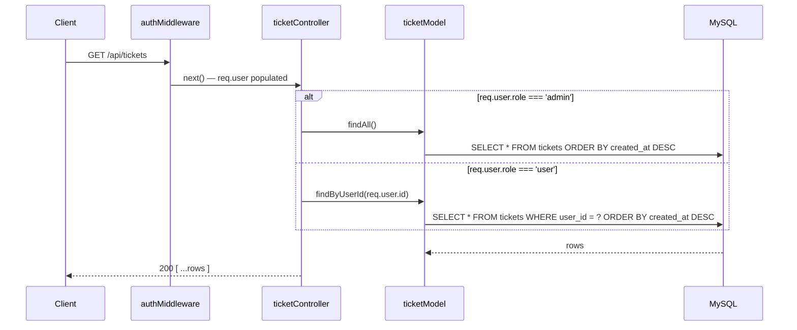
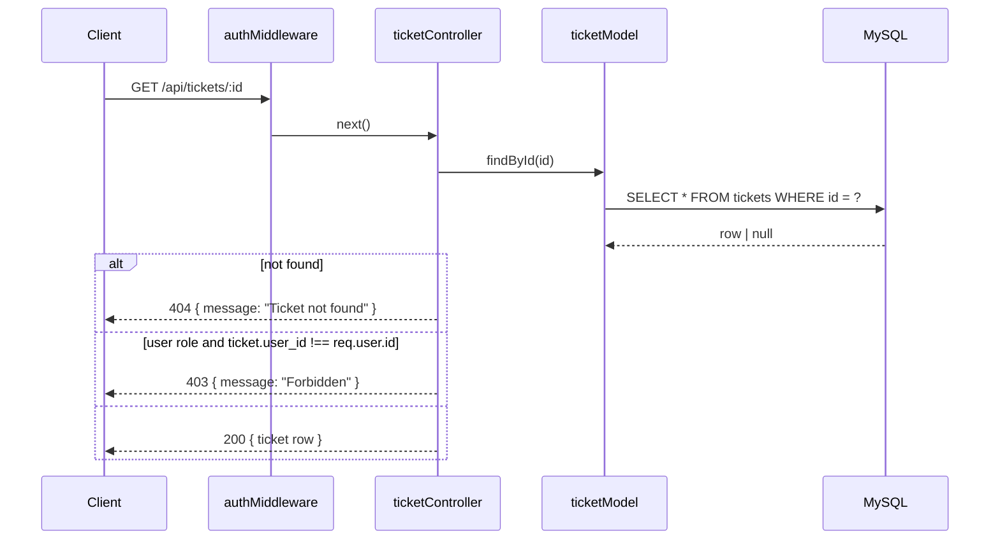
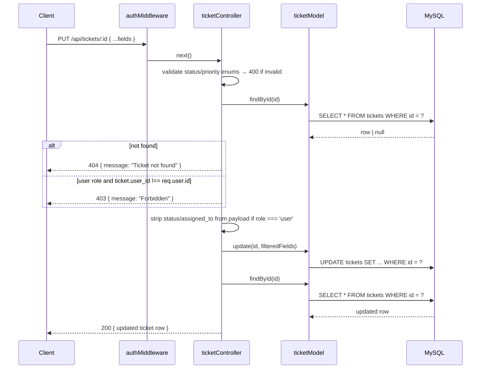
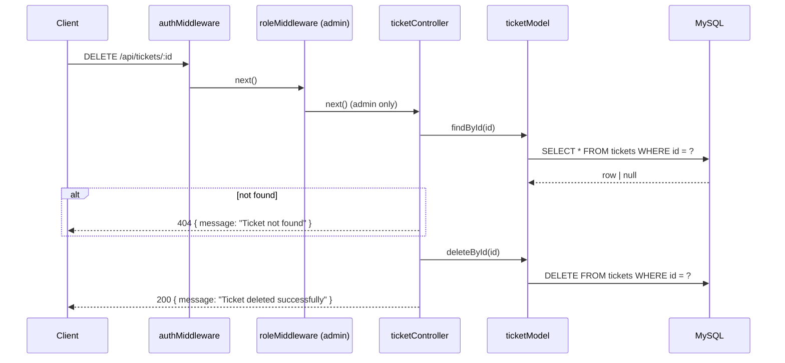

# Design Document: Ticket Management

## Overview

The Ticket Management feature adds full CRUD support for IT helpdesk tickets on top of the existing Express + MySQL + JWT foundation. It introduces four new files:

- `backend/db/migrations/002_create_tickets_table.sql` — DDL for the `tickets` table
- `backend/models/ticketModel.js` — SQL data-access layer for the `tickets` table
- `backend/controllers/ticketController.js` — request handlers for all ticket endpoints
- `backend/routes/ticketRoutes.js` — Express router wiring ticket endpoints with auth/role guards

Role-based access is enforced at the controller level (not just the route level) so that a regular user cannot read or modify another user's ticket even if they guess the ID.

---

## Architecture



### Request Flow — Create Ticket



### Request Flow — List Tickets



### Request Flow — Get Ticket by ID



### Request Flow — Update Ticket



### Request Flow — Delete Ticket



---

## Components and Interfaces

### `backend/models/ticketModel.js`

```js
// All functions return Promises and propagate DB errors to callers.

/**
 * @param {{ title: string, description: string, priority?: string, userId: number }} data
 * @returns {Promise<Object>} the newly created ticket row (full SELECT after INSERT)
 */
async function create({ title, description, priority, userId }) {}

/**
 * @returns {Promise<Object[]>} all ticket rows ordered by created_at DESC
 */
async function findAll() {}

/**
 * @param {number} id
 * @returns {Promise<Object|null>} matching ticket row or null
 */
async function findById(id) {}

/**
 * @param {number} userId
 * @returns {Promise<Object[]>} ticket rows for the given user_id, ordered by created_at DESC
 */
async function findByUserId(userId) {}

/**
 * @param {number} id
 * @param {string} status  One of: 'open', 'in_progress', 'resolved', 'closed'
 * @returns {Promise<number>} affectedRows
 */
async function updateStatus(id, status) {}

/**
 * @param {number} id
 * @param {{ title?: string, description?: string, priority?: string, status?: string, assignedTo?: number|null }} fields
 * @returns {Promise<number>} affectedRows
 */
async function update(id, fields) {}

/**
 * @param {number} id
 * @returns {Promise<number>} affectedRows
 */
async function deleteById(id) {}

module.exports = { create, findAll, findById, findByUserId, updateStatus, update, deleteById };
```

### `backend/controllers/ticketController.js`

```js
/**
 * POST /api/tickets
 * Validates input, creates ticket, returns 201 with ticket object.
 */
async function createTicket(req, res, next) {}

/**
 * GET /api/tickets
 * Returns all tickets for admins, own tickets for users.
 */
async function getTickets(req, res, next) {}

/**
 * GET /api/tickets/:id
 * Returns ticket by id; enforces ownership for non-admin users.
 */
async function getTicketById(req, res, next) {}

/**
 * PUT /api/tickets/:id
 * Updates ticket fields; enforces ownership and field restrictions for non-admin users.
 */
async function updateTicket(req, res, next) {}

/**
 * DELETE /api/tickets/:id
 * Deletes ticket by id; admin-only (enforced at route level too).
 */
async function deleteTicket(req, res, next) {}

module.exports = { createTicket, getTickets, getTicketById, updateTicket, deleteTicket };
```

### `backend/routes/ticketRoutes.js`

```js
const router = require('express').Router();
const { authenticate } = require('../middleware/authMiddleware');
const { requireRole } = require('../middleware/roleMiddleware');
const { createTicket, getTickets, getTicketById, updateTicket, deleteTicket } =
  require('../controllers/ticketController');

router.post('/',     authenticate, createTicket);
router.get('/',      authenticate, getTickets);
router.get('/:id',   authenticate, getTicketById);
router.put('/:id',   authenticate, updateTicket);
router.delete('/:id', authenticate, requireRole('admin'), deleteTicket);

module.exports = router;
```

---

## Data Models

### `tickets` Table DDL

```sql
CREATE TABLE IF NOT EXISTS tickets (
  id          INT UNSIGNED  NOT NULL AUTO_INCREMENT,
  title       VARCHAR(255)  NOT NULL,
  description TEXT          NOT NULL,
  status      ENUM('open','in_progress','resolved','closed')
                            NOT NULL DEFAULT 'open',
  priority    ENUM('low','medium','high')
                            NOT NULL DEFAULT 'medium',
  user_id     INT UNSIGNED  NOT NULL,
  assigned_to INT UNSIGNED  NULL,
  created_at  DATETIME      NOT NULL DEFAULT CURRENT_TIMESTAMP,
  updated_at  DATETIME      NOT NULL DEFAULT CURRENT_TIMESTAMP ON UPDATE CURRENT_TIMESTAMP,
  PRIMARY KEY (id),
  CONSTRAINT fk_tickets_user    FOREIGN KEY (user_id)     REFERENCES users(id),
  CONSTRAINT fk_tickets_assigned FOREIGN KEY (assigned_to) REFERENCES users(id)
);
```

### Ticket Row Shape

```json
{
  "id": 1,
  "title": "Printer not working",
  "description": "The printer on floor 2 is offline.",
  "status": "open",
  "priority": "medium",
  "user_id": 42,
  "assigned_to": null,
  "created_at": "2024-01-15T09:00:00.000Z",
  "updated_at": "2024-01-15T09:00:00.000Z"
}
```

### Valid Enum Values

| Field | Valid values |
|-------|-------------|
| `status` | `'open'`, `'in_progress'`, `'resolved'`, `'closed'` |
| `priority` | `'low'`, `'medium'`, `'high'` |

### API Response Shapes

Create / Update success:
```json
{ "id": 1, "title": "...", "description": "...", "status": "open", "priority": "medium", "user_id": 42, "assigned_to": null, "created_at": "...", "updated_at": "..." }
```

Delete success:
```json
{ "message": "Ticket deleted successfully" }
```

Error responses:
```json
{ "message": "<human-readable description>" }
```

---


## Correctness Properties

*A property is a characteristic or behavior that should hold true across all valid executions of a system — essentially, a formal statement about what the system should do. Properties serve as the bridge between human-readable specifications and machine-verifiable correctness guarantees.*

Property 1: Create round-trip
*For any* valid ticket input `{ title, description, priority, userId }`, calling `create()` and then `findById()` with the returned id must produce a row where `title`, `description`, `priority`, and `user_id` match the input, `status` equals `'open'`, and `assigned_to` is `null`.
**Validates: Requirements 1.3, 1.4, 2.1, 2.3, 3.1, 3.2**

Property 2: findAll ordering invariant
*For any* set of tickets in the database, `findAll()` must return them such that each row's `created_at` is greater than or equal to the `created_at` of every subsequent row (descending order).
**Validates: Requirements 2.2**

Property 3: findByUserId filter correctness
*For any* `userId` and any set of tickets in the database, every row returned by `findByUserId(userId)` must have `user_id` equal to `userId`, and no row with a different `user_id` must appear in the result.
**Validates: Requirements 2.4**

Property 4: updateStatus round-trip
*For any* existing ticket and any valid status value from `['open', 'in_progress', 'resolved', 'closed']`, calling `updateStatus(id, status)` followed by `findById(id)` must return a row where `status` equals the new value and all other fields are unchanged.
**Validates: Requirements 2.5**

Property 5: update partial fields invariant
*For any* existing ticket and any non-empty subset of updatable fields `{ title?, description?, priority?, status?, assignedTo? }`, calling `update(id, fields)` must change exactly the provided fields and leave all other fields with their previous values.
**Validates: Requirements 2.6**

Property 6: deleteById round-trip
*For any* existing ticket, calling `deleteById(id)` must return an `affectedRows` count of 1, and a subsequent `findById(id)` must return `null`.
**Validates: Requirements 2.7, 6.1, 6.2**

Property 7: Create sets user_id from authenticated user
*For any* authenticated user making a `POST /api/tickets` request with valid `title` and `description`, the `user_id` on the created ticket must equal `req.user.id` and must not be overridable by a `user_id` field in the request body.
**Validates: Requirements 3.1**

Property 8: Create validates required fields
*For any* `POST /api/tickets` request where `title` or `description` is absent, empty, or whitespace-only, the response must be HTTP 400 with `{ "message": "Title and description are required" }` and no ticket must be inserted.
**Validates: Requirements 3.3**

Property 9: Role-based list filtering
*For any* set of tickets in the database, a `GET /api/tickets` request from an admin must return all tickets, while the same request from a regular user must return only tickets where `user_id` equals that user's id — with no tickets from other users present.
**Validates: Requirements 4.1, 4.2**

Property 10: Ownership enforcement on read and write
*For any* regular user and any ticket whose `user_id` does not equal that user's id, both `GET /api/tickets/:id` and `PUT /api/tickets/:id` must return HTTP 403 with `{ "message": "Forbidden" }`.
**Validates: Requirements 4.5, 5.3**

Property 11: Enum validation on update
*For any* `PUT /api/tickets/:id` request containing a `status` value not in `['open', 'in_progress', 'resolved', 'closed']` or a `priority` value not in `['low', 'medium', 'high']`, the response must be HTTP 400 with the appropriate error message and the ticket must remain unchanged.
**Validates: Requirements 5.5, 5.6**

Property 12: Update round-trip
*For any* valid `PUT /api/tickets/:id` request, the response must be HTTP 200 and the returned ticket object must reflect all updated fields as sent in the request body.
**Validates: Requirements 5.7**

---

## Error Handling

| Scenario | Handler | HTTP Status | Response body |
|----------|---------|-------------|---------------|
| Missing title or description on create | ticketController.createTicket | 400 | `{ message: "Title and description are required" }` |
| Ticket not found (any route) | ticketController.* | 404 | `{ message: "Ticket not found" }` |
| User accessing another user's ticket | ticketController.getTicketById / updateTicket | 403 | `{ message: "Forbidden" }` |
| Invalid status value on update | ticketController.updateTicket | 400 | `{ message: "Invalid status value" }` |
| Invalid priority value on update | ticketController.updateTicket | 400 | `{ message: "Invalid priority value" }` |
| Non-admin attempting DELETE | roleMiddleware (requireRole) | 403 | `{ message: "Forbidden" }` |
| Missing / malformed Authorization header | authMiddleware | 401 | `{ message: "No token provided" }` |
| Invalid or expired JWT | authMiddleware | 401 | `{ message: "Invalid or expired token" }` |
| Unexpected DB error | next(err) → Error_Handler | 500 | `{ message: "Internal Server Error" }` |

All unexpected errors are forwarded to the existing centralized error handler via `next(err)`.

---

## Testing Strategy

### Unit Testing

Use **Jest** with **supertest** for HTTP-level tests and plain unit tests for model functions. Focus on:

- `ticketModel` — mock the DB pool and verify correct SQL is executed for each method; test `null` returns for missing rows
- `ticketController` — test each validation branch (missing fields, invalid enums, ownership checks) and happy paths for all five handlers
- Route-level integration — verify auth middleware is applied and DELETE is admin-only

### Property-Based Testing

Use **fast-check** (already in `devDependencies`). Each property test runs a minimum of 100 iterations.

Tag format: `Feature: ticket-management, Property N: <property text>`

| Property | Test description | fast-check strategy |
|----------|-----------------|---------------------|
| P1 | Create round-trip | `fc.record({ title: fc.string({minLength:1}), description: fc.string({minLength:1}), priority: fc.constantFrom('low','medium','high') })` → create → findById → assert fields match |
| P2 | findAll ordering | Insert N tickets with varying timestamps → findAll → assert each `created_at >= next` |
| P3 | findByUserId filter | Generate tickets for multiple users → findByUserId(userId) → assert all rows have correct `user_id` |
| P4 | updateStatus round-trip | `fc.constantFrom('open','in_progress','resolved','closed')` → updateStatus → findById → assert status changed |
| P5 | update partial fields | Generate random subset of updatable fields → update → findById → assert only those fields changed |
| P6 | deleteById round-trip | Create ticket → deleteById → findById → assert null |
| P7 | Create sets user_id | Generate user ids → POST /api/tickets → assert ticket.user_id === req.user.id |
| P8 | Create validates required fields | Generate objects missing title or description → POST → assert 400 |
| P9 | Role-based list filtering | Generate tickets for multiple users → GET /api/tickets as admin vs user → assert correct subsets |
| P10 | Ownership enforcement | Generate user + ticket owned by different user → GET/PUT → assert 403 |
| P11 | Enum validation | `fc.string().filter(s => !VALID_STATUSES.includes(s))` → PUT with invalid status → assert 400 |
| P12 | Update round-trip | Generate valid update payload → PUT → assert response reflects changes |

### Dual Approach Rationale

Unit tests pin down exact error messages, HTTP status codes, and SQL query shapes for specific scenarios. Property tests verify that ownership rules, filtering logic, and enum validation hold across all possible inputs — critical for access-control correctness where a single edge case can be a security vulnerability.
