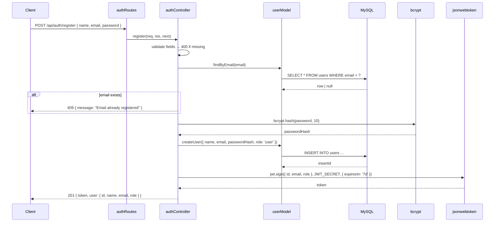
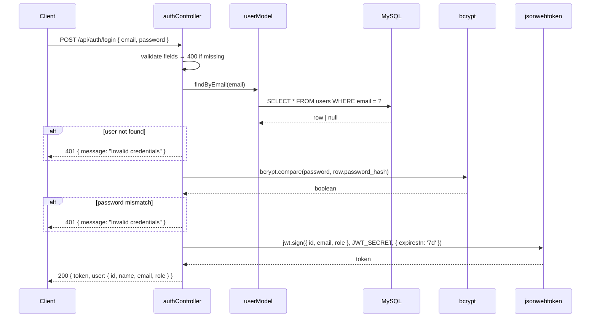
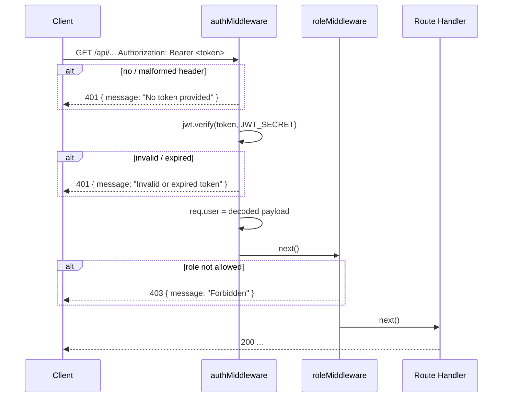

# Design Document: User Authentication

## Overview

The User Authentication feature adds registration, login, JWT session management, and role-based access control to the IT Helpdesk Ticketing System. It introduces five new files on top of the existing Express + MySQL foundation:

- `backend/models/userModel.js` — SQL data-access layer for the `users` table
- `backend/controllers/authController.js` — registration and login business logic
- `backend/routes/authRoutes.js` — updated to wire the two auth endpoints (replaces the stub)
- `backend/middleware/authMiddleware.js` — JWT verification middleware
- `backend/middleware/roleMiddleware.js` — role-based access control factory

Passwords are hashed with **bcrypt** (cost factor 10). Sessions are represented as **JWTs** signed with `HS256`, carrying `{ id, email, role }` and expiring after `7d`. No refresh-token mechanism is introduced at this stage.

---

## Architecture

```mermaid
flowchart TD
    CLIENT["HTTP Client"] -->|POST /api/auth/register\nPOST /api/auth/login| ROUTER["authRoutes.js"]
    ROUTER --> CTRL["authController.js"]
    CTRL --> MODEL["userModel.js"]
    MODEL --> DB["mysql2 pool\n(config/db.js)"]
    CTRL --> BCRYPT["bcrypt\n(hash / compare)"]
    CTRL --> JWT["jsonwebtoken\n(sign)"]

    CLIENT -->|Protected routes| AUTHMW["authMiddleware.js\n(verify JWT)"]
    AUTHMW --> ROLEMW["roleMiddleware.js\n(check role)"]
    AUTHMW --> JWT2["jsonwebtoken\n(verify)"]
    ROLEMW --> HANDLER["Route Handler"]
```



### Request Flow — Registration



### Request Flow — Login



### Request Flow — Protected Route



---

## Components and Interfaces

### `backend/models/userModel.js`

```js
// All functions return Promises and propagate DB errors to callers.

/**
 * @param {string} email
 * @returns {Promise<Object|null>} full user row or null
 */
async function findByEmail(email) {}

/**
 * @param {{ name: string, email: string, passwordHash: string, role?: string }} data
 * @returns {Promise<number>} insertId of the new row
 */
async function createUser({ name, email, passwordHash, role }) {}

/**
 * @param {number} id
 * @returns {Promise<Object|null>} full user row or null
 */
async function findById(id) {}

module.exports = { findByEmail, createUser, findById };
```

### `backend/controllers/authController.js`

```js
/**
 * POST /api/auth/register
 * Validates input, checks for duplicate email, hashes password, creates user, returns JWT.
 */
async function register(req, res, next) {}

/**
 * POST /api/auth/login
 * Validates input, looks up user, compares password, returns JWT.
 */
async function login(req, res, next) {}

module.exports = { register, login };
```

### `backend/routes/authRoutes.js`

```js
const router = require('express').Router();
const { register, login } = require('../controllers/authController');

router.post('/register', register);
router.post('/login', login);

module.exports = router;
```

### `backend/middleware/authMiddleware.js`

```js
/**
 * Extracts and verifies the Bearer JWT from the Authorization header.
 * On success: attaches decoded payload to req.user and calls next().
 * On failure: returns 401.
 */
function authenticate(req, res, next) {}

module.exports = { authenticate };
```

### `backend/middleware/roleMiddleware.js`

```js
/**
 * Factory that returns middleware enforcing role membership.
 * @param {...string} roles  Allowed role values (e.g. 'admin', 'user')
 * @returns {Function} Express middleware
 */
function requireRole(...roles) {
  return function (req, res, next) {};
}

module.exports = { requireRole };
```

---

## Data Models

### `users` Table DDL

```sql
CREATE TABLE IF NOT EXISTS users (
  id            INT UNSIGNED    NOT NULL AUTO_INCREMENT,
  name          VARCHAR(100)    NOT NULL,
  email         VARCHAR(255)    NOT NULL,
  password_hash VARCHAR(255)    NOT NULL,
  role          ENUM('user','admin') NOT NULL DEFAULT 'user',
  created_at    DATETIME        NOT NULL DEFAULT CURRENT_TIMESTAMP,
  PRIMARY KEY (id),
  UNIQUE KEY uq_users_email (email)
);
```

### JWT Payload Shape

```json
{
  "id": 42,
  "email": "alice@example.com",
  "role": "user",
  "iat": 1700000000,
  "exp": 1700604800
}
```

### API Response Shapes

Registration / Login success:
```json
{
  "token": "<jwt string>",
  "user": {
    "id": 42,
    "name": "Alice",
    "email": "alice@example.com",
    "role": "user"
  }
}
```

Error responses:
```json
{ "message": "<human-readable description>" }
```

### New Dependencies

| Package | Purpose | Install |
|---------|---------|---------|
| `bcryptjs` | Password hashing and comparison | `npm install bcryptjs` |
| `jsonwebtoken` | JWT signing and verification | `npm install jsonwebtoken` |

> `bcryptjs` is the pure-JS implementation of bcrypt — no native build step required, which keeps CI simple. It is API-compatible with `bcrypt`.

---

## Correctness Properties

*A property is a characteristic or behavior that should hold true across all valid executions of a system — essentially, a formal statement about what the system should do. Properties serve as the bridge between human-readable specifications and machine-verifiable correctness guarantees.*

Property 1: Password hash is never the plaintext password
*For any* plaintext password string, the value stored in `password_hash` after `createUser` must not equal the original plaintext string.
**Validates: Requirements 3.5**

Property 2: bcrypt round-trip — hash then compare succeeds
*For any* non-empty plaintext password, hashing it with bcrypt and then calling `bcrypt.compare` with the same plaintext must return `true`.
**Validates: Requirements 4.1**

Property 3: bcrypt compare rejects wrong password
*For any* two distinct plaintext strings `p1` and `p2`, hashing `p1` and then calling `bcrypt.compare(p2, hash)` must return `false`.
**Validates: Requirements 4.5**

Property 4: JWT round-trip — sign then verify recovers payload
*For any* payload `{ id, email, role }`, signing it with `jwt.sign` and then verifying with `jwt.verify` using the same secret must return an object containing the original `id`, `email`, and `role` values.
**Validates: Requirements 3.6, 4.6**

Property 5: Registration with missing fields returns 400
*For any* combination of `name`, `email`, `password` where at least one field is absent or empty, `POST /api/auth/register` must return HTTP 400.
**Validates: Requirements 3.3**

Property 6: Login with missing fields returns 400
*For any* combination of `email`, `password` where at least one field is absent or empty, `POST /api/auth/login` must return HTTP 400.
**Validates: Requirements 4.3**

Property 7: Auth middleware rejects requests without a valid Bearer token
*For any* request that either has no `Authorization` header, a non-Bearer scheme, or a tampered/expired token, `authenticate` must not call `next()` and must return HTTP 401.
**Validates: Requirements 5.3, 5.4**

Property 8: Role middleware allows only permitted roles
*For any* `requireRole(...roles)` middleware and any `req.user.role` value, the middleware must call `next()` if and only if `roles` includes `req.user.role`.
**Validates: Requirements 6.2, 6.3**

---

## Error Handling

| Scenario | Handler | HTTP Status | Response body |
|----------|---------|-------------|---------------|
| Missing register fields | authController.register | 400 | `{ message: "Name, email, and password are required" }` |
| Duplicate email on register | authController.register | 409 | `{ message: "Email already registered" }` |
| Missing login fields | authController.login | 400 | `{ message: "Email and password are required" }` |
| Email not found on login | authController.login | 401 | `{ message: "Invalid credentials" }` |
| Wrong password on login | authController.login | 401 | `{ message: "Invalid credentials" }` |
| Missing / malformed Authorization header | authMiddleware | 401 | `{ message: "No token provided" }` |
| Invalid or expired JWT | authMiddleware | 401 | `{ message: "Invalid or expired token" }` |
| Insufficient role | roleMiddleware | 403 | `{ message: "Forbidden" }` |
| Unexpected DB / bcrypt error | next(err) → Error_Handler | 500 | `{ message: "Internal Server Error" }` |

All unexpected errors are forwarded to the existing centralized `Error_Handler` via `next(err)`.

---

## Testing Strategy

### Unit Testing

Use **Jest** with **supertest** for HTTP-level tests and plain unit tests for model functions. Focus on:

- `userModel` — mock the DB pool and verify correct SQL is executed for each method
- `authController` — test each validation branch (missing fields, duplicate email, wrong password) and the happy path
- `authMiddleware` — test missing header, wrong scheme, expired token, valid token
- `roleMiddleware` — test allowed role calls `next()`, disallowed role returns 403

### Property-Based Testing

Use **fast-check** (already in `devDependencies`). Each property test runs a minimum of 100 iterations.

Tag format: `Feature: user-authentication, Property N: <property text>`

| Property | Test description | fast-check strategy |
|----------|-----------------|---------------------|
| P1 | Hash ≠ plaintext | `fc.string()` → hash → assert `hash !== plaintext` |
| P2 | bcrypt round-trip success | `fc.string({ minLength: 1 })` → hash → compare same → `true` |
| P3 | bcrypt compare rejects wrong password | `fc.tuple(fc.string(), fc.string()).filter(([a,b]) => a !== b)` → hash `a` → compare `b` → `false` |
| P4 | JWT round-trip | `fc.record({ id: fc.integer(), email: fc.emailAddress(), role: fc.constantFrom('user','admin') })` → sign → verify → deep equal |
| P5 | Register missing fields → 400 | Generate objects with at least one of `name/email/password` missing |
| P6 | Login missing fields → 400 | Generate objects with at least one of `email/password` missing |
| P7 | Auth middleware rejects invalid tokens | Generate arbitrary strings that are not valid JWTs |
| P8 | Role middleware allows only permitted roles | Generate role sets and request roles; verify allow/deny logic |

### Dual Approach Rationale

Unit tests pin down exact error messages and HTTP status codes for specific scenarios. Property tests verify the cryptographic and authorization invariants hold across all possible inputs — critical for security-sensitive code where a single edge case can be a vulnerability.
