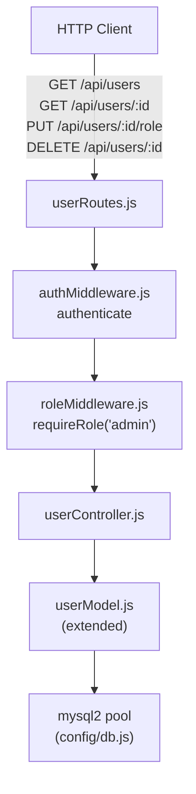
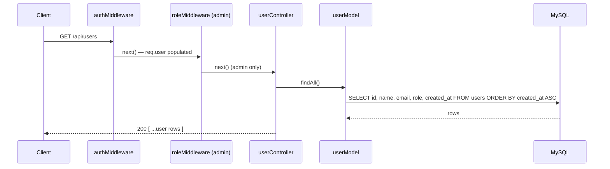
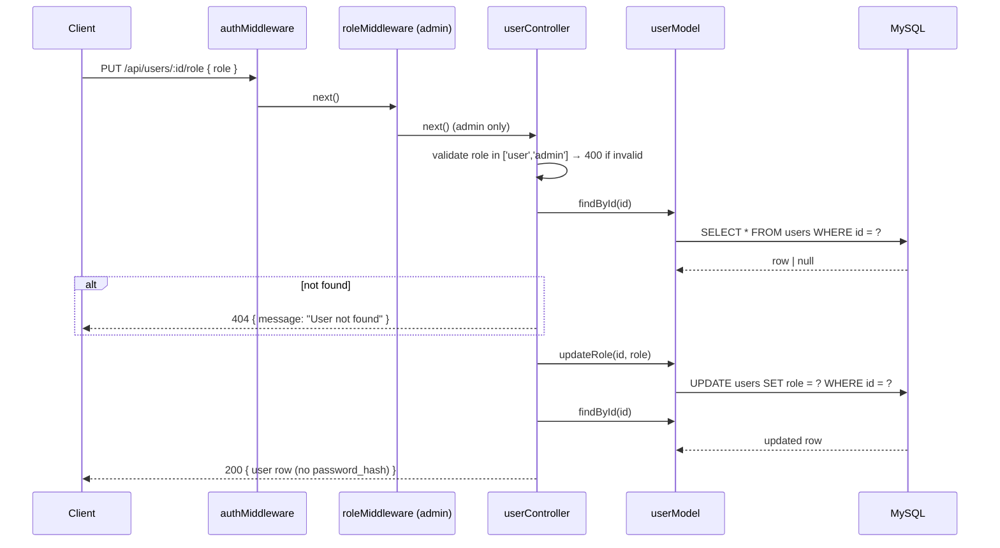
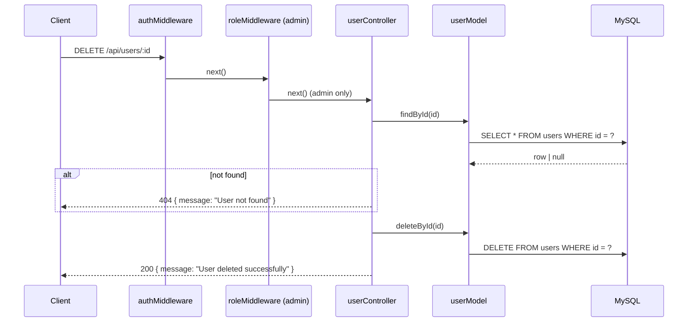

# Design Document: User Management

## Overview

The User Management feature exposes admin-only CRUD endpoints for managing user accounts. It extends the existing `userModel.js` with three new methods and introduces two new files:

- `backend/controllers/userController.js` — request handlers for list, get-by-id, update-role, and delete endpoints
- `backend/routes/userRoutes.js` — Express router wiring all four endpoints with auth and admin role guards

All endpoints are restricted to `admin` role via the existing `requireRole` middleware. The `password_hash` field is never returned in any response.

---

## Architecture



### Request Flow — List Users



### Request Flow — Update Role



### Request Flow — Delete User



---

## Components and Interfaces

### `backend/models/userModel.js` — additions

```js
// Added to the existing userModel.js exports.

/**
 * Returns all user rows ordered by created_at ASC, excluding password_hash.
 * @returns {Promise<Object[]>}
 */
async function findAll() {}

/**
 * Updates the role of the matching user row.
 * @param {number} id
 * @param {string} role  One of: 'user', 'admin'
 * @returns {Promise<number>} affectedRows
 */
async function updateRole(id, role) {}

/**
 * Deletes the matching user row.
 * @param {number} id
 * @returns {Promise<number>} affectedRows
 */
async function deleteById(id) {}
```

The existing `findById(id)` is reused to fetch updated user objects after role updates. The controller strips `password_hash` from `findById` results before responding.

### `backend/controllers/userController.js`

```js
/**
 * GET /api/users
 * Returns all users (no password_hash). Admin only.
 */
async function getUsers(req, res, next) {}

/**
 * GET /api/users/:id
 * Returns user by id (no password_hash). Admin only. 404 if not found.
 */
async function getUserById(req, res, next) {}

/**
 * PUT /api/users/:id/role
 * Validates role, updates it, returns updated user (no password_hash). Admin only.
 */
async function updateUserRole(req, res, next) {}

/**
 * DELETE /api/users/:id
 * Deletes user by id. Admin only. 404 if not found.
 */
async function deleteUser(req, res, next) {}

module.exports = { getUsers, getUserById, updateUserRole, deleteUser };
```

### `backend/routes/userRoutes.js`

```js
const router = require('express').Router();
const { authenticate } = require('../middleware/authMiddleware');
const { requireRole } = require('../middleware/roleMiddleware');
const { getUsers, getUserById, updateUserRole, deleteUser } =
  require('../controllers/userController');

const adminOnly = [authenticate, requireRole('admin')];

router.get('/',          ...adminOnly, getUsers);
router.get('/:id',       ...adminOnly, getUserById);
router.put('/:id/role',  ...adminOnly, updateUserRole);
router.delete('/:id',    ...adminOnly, deleteUser);

module.exports = router;
```

---

## Data Models

### User Row Shape (public — no password_hash)

```json
{
  "id": 1,
  "name": "Jane Smith",
  "email": "[email]",
  "role": "admin",
  "created_at": "2024-01-15T09:00:00.000Z"
}
```

### Valid Role Values

| Field | Valid values |
|-------|-------------|
| `role` | `'user'`, `'admin'` |

### API Response Shapes

List / Get-by-id / Update-role success:
```json
{ "id": 1, "name": "...", "email": "...", "role": "user", "created_at": "..." }
```

Delete success:
```json
{ "message": "User deleted successfully" }
```

Error responses:
```json
{ "message": "<human-readable description>" }
```

---

## Correctness Properties

*A property is a characteristic or behavior that should hold true across all valid executions of a system — essentially, a formal statement about what the system should do. Properties serve as the bridge between human-readable specifications and machine-verifiable correctness guarantees.*

Property 1: password_hash is never exposed
*For any* set of users in the database, every user object returned by `findAll()`, `getUserById`, `getUsers`, or `updateUserRole` must not contain a `password_hash` field.
**Validates: Requirements 1.1, 2.1, 3.1, 4.1**

Property 2: updateRole round-trip (model)
*For any* existing user id and any valid role value from `['user', 'admin']`, calling `updateRole(id, role)` followed by `findById(id)` must return a row where `role` equals the new value and all other fields are unchanged.
**Validates: Requirements 1.2**

Property 3: deleteById round-trip (model)
*For any* existing user, `deleteById(id)` must return `affectedRows` of 1, and a subsequent `findById(id)` must return `null`.
**Validates: Requirements 1.3, 5.1**

Property 4: Update role round-trip (HTTP)
*For any* existing user and any valid role value, a `PUT /api/users/:id/role` request must return HTTP 200, and a subsequent `GET /api/users/:id` must return a user object where `role` equals the value that was set.
**Validates: Requirements 4.1**

Property 5: Invalid role value rejected
*For any* string that is not `'user'` or `'admin'`, a `PUT /api/users/:id/role` request with that value must return HTTP 400 with `{ "message": "Invalid role value" }` and the user's role must remain unchanged.
**Validates: Requirements 4.2**

Property 6: Delete user round-trip (HTTP)
*For any* existing user, an admin `DELETE /api/users/:id` request must return HTTP 200 with `{ "message": "User deleted successfully" }`, and a subsequent `GET /api/users/:id` must return HTTP 404.
**Validates: Requirements 5.1, 5.2**

---

## Error Handling

| Scenario | Handler | HTTP Status | Response body |
|----------|---------|-------------|---------------|
| User not found (GET, PUT, DELETE) | userController.* | 404 | `{ message: "User not found" }` |
| Invalid role value on update | userController.updateUserRole | 400 | `{ message: "Invalid role value" }` |
| Non-admin attempting any endpoint | roleMiddleware (requireRole) | 403 | `{ message: "Forbidden" }` |
| Missing / malformed Authorization header | authMiddleware | 401 | `{ message: "No token provided" }` |
| Invalid or expired JWT | authMiddleware | 401 | `{ message: "Invalid or expired token" }` |
| Unexpected DB error | next(err) → Error_Handler | 500 | `{ message: "Internal Server Error" }` |

All unexpected errors are forwarded to the existing centralized error handler via `next(err)`.

---

## Testing Strategy

### Unit Testing

Use **Jest** with **supertest** for HTTP-level tests and plain unit tests for model functions. Focus on:

- `userModel` (new methods) — mock the DB pool; verify correct SQL for `findAll`, `updateRole`, `deleteById`; confirm `password_hash` is excluded from `findAll` results
- `userController` — test each validation branch (invalid role, user not found) and happy paths for all four handlers
- Route-level integration — verify all routes require admin role; non-admin and unauthenticated requests are rejected

### Property-Based Testing

Use **fast-check** (already in `devDependencies`). Each property test runs a minimum of 100 iterations.

Tag format: `Feature: user-management, Property N: <property text>`

| Property | Test description | fast-check strategy |
|----------|-----------------|---------------------|
| P1 | password_hash never exposed | Generate users → insert → call findAll / getUserById / updateUserRole → assert no row has `password_hash` key |
| P2 | updateRole round-trip (model) | `fc.constantFrom('user','admin')` → updateRole → findById → assert role changed, other fields same |
| P3 | deleteById round-trip (model) | Create user → deleteById → findById → assert null |
| P4 | Update role round-trip (HTTP) | `fc.constantFrom('user','admin')` → PUT → GET → assert role matches |
| P5 | Invalid role value rejected | `fc.string().filter(s => s !== 'user' && s !== 'admin')` → PUT → assert 400 and role unchanged |
| P6 | Delete user round-trip (HTTP) | Create user → admin DELETE → GET → assert 404 |

### Dual Approach Rationale

Unit tests verify exact SQL shapes, error messages, and status codes for specific scenarios. Property tests confirm that the `password_hash` exclusion invariant holds across all user records (critical for security) and that role update/delete operations are always consistent regardless of input values.
